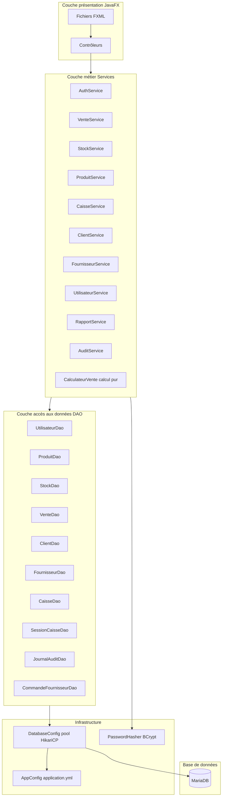
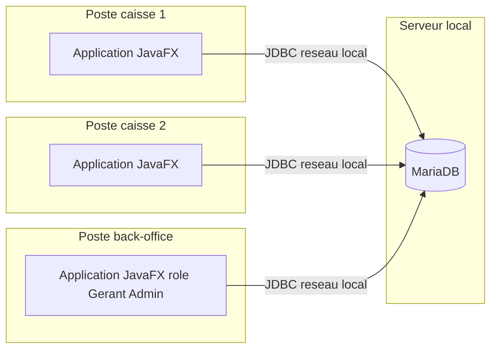

# Architecture applicative

## Vue en couches

## Principes de conception

- **Séparation stricte des responsabilités** : les contrôleurs JavaFX ne contiennent aucune requête SQL ni aucune règle métier ; ils délèguent systématiquement aux services. Les DAO ne contiennent aucune règle métier, uniquement des opérations CRUD et la gestion des transactions JDBC.
- **Double contrôle d'accès** : la couche présentation masque les fonctionnalités non autorisées pour l'ergonomie (`PrincipalController.appliquerVisibiliteSelonPermissions`), mais c'est la couche métier qui constitue la véritable barrière de sécurité (`AuthService.exigerPermission`, appelé en tête de chaque méthode sensible des services).
- **Transactions portées par les services, pas par les DAO** : un DAO individuel ne décide jamais quand committer ; c'est le service qui orchestre la transaction quand une opération métier (ex. une vente) doit toucher plusieurs tables de façon atomique.
- **Connexions mutualisées via un pool** (HikariCP) plutôt qu'une connexion par requête : indispensable avec plusieurs caisses actives simultanément sur le réseau local.
- **Configuration externalisée** : les identifiants de connexion à la base ne sont jamais codés en dur ; ils proviennent de `application.yml`, surchargeable par variables d'environnement (`DB_HOST`, `DB_PASSWORD`, etc.) pour ne jamais committer de secret de production dans le dépôt de code.

## Déploiement (réseau local multi-caisses)

Chaque poste exécute une instance complète de l'application (le `.jar`
généré par `mvn package`) et se connecte directement au serveur MariaDB
partagé. Il n'y a pas de serveur d'application intermédiaire : la
cohérence des données en cas d'accès concurrent est assurée au niveau de
la base (transactions, verrous), comme détaillé dans
`diagramme_sequence_vente.md`.
