# Diagramme de cas d'utilisation

```mermaid
flowchart TB
    subgraph Acteurs
        Caissier(["Caissier"])
        Magasinier(["Magasinier"])
        Gerant(["Gérant"])
        Admin(["Administrateur"])
    end

    subgraph SystemeGestion ["Système de gestion de supermarché"]
        UC1["S'authentifier"]
        UC2["Ouvrir une session de caisse"]
        UC3["Enregistrer une vente"]
        UC4["Encaisser un paiement"]
        UC5["Fermer une session de caisse"]
        UC6["Annuler une vente"]
        UC7["Gérer les produits"]
        UC8["Gérer les stocks"]
        UC9["Réceptionner une commande fournisseur"]
        UC10["Gérer les fournisseurs"]
        UC11["Passer une commande fournisseur"]
        UC12["Gérer les clients"]
        UC13["Consulter les rapports"]
        UC14["Gérer les comptes utilisateurs"]
        UC15["Consulter le journal d'audit"]
        UC16["Changer son mot de passe"]
    end

    Caissier --> UC1
    Caissier --> UC2
    Caissier --> UC3
    Caissier --> UC4
    Caissier --> UC5
    Caissier --> UC6
    Caissier --> UC12
    Caissier --> UC16

    Magasinier --> UC1
    Magasinier --> UC7
    Magasinier --> UC8
    Magasinier --> UC9
    Magasinier --> UC10
    Magasinier --> UC11
    Magasinier --> UC16

    Gerant --> UC1
    Gerant --> UC7
    Gerant --> UC8
    Gerant --> UC9
    Gerant --> UC10
    Gerant --> UC11
    Gerant --> UC12
    Gerant --> UC13
    Gerant --> UC15
    Gerant --> UC16

    Admin --> UC1
    Admin --> UC14
    Admin --> UC15
    Admin --> UC16

    UC3 -.->|requiert| UC2
    UC4 -.->|fait partie de| UC3
    UC6 -.->|requiert| UC3
```

## Notes

- Chaque cas d'utilisation correspond à une permission applicative (voir `securite.md`) : le système vérifie le rôle de l'utilisateur connecté avant d'autoriser l'action, indépendamment de ce que l'interface affiche.
- "Encaisser un paiement" est représenté comme partie intégrante d'"Enregistrer une vente" car l'application traite la création du ticket et l'enregistrement du règlement dans une unique transaction atomique.
