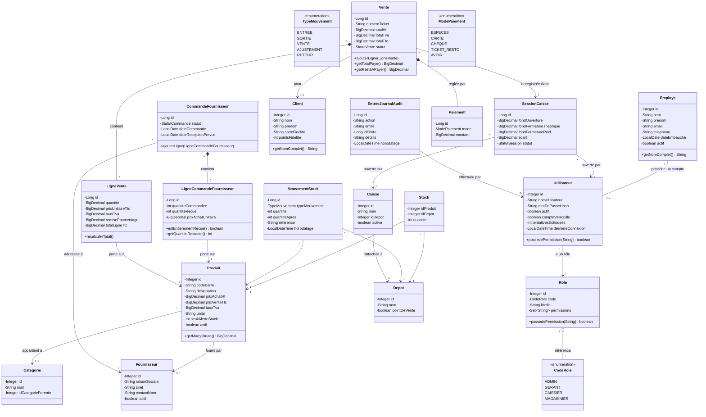

# Diagramme de classes — Modèle de domaine

Ce diagramme représente les entités métier principales et leurs relations.
Les classes techniques (DAO, services, contrôleurs JavaFX) ne sont pas représentées ici ; voir `architecture.md` pour la vue en couches.

## Notes de lecture

- **Employe / Utilisateur** : séparation volontaire entre l'identité (Employe) et le compte de connexion (Utilisateur) — un employé peut exister sans avoir d'accès informatique.
- **Role / permissions** : les permissions sont gérées comme un ensemble de codes (`String`) plutôt que des classes dédiées, pour rester simples à étendre côté base de données sans migration de schéma Java.
- **LigneVente** historise `prixUnitaireTtc` et `tauxTva` au moment de la vente : un changement de prix catalogue ultérieur n'affecte jamais un ticket déjà émis.
- **MouvementStock** trace tout changement de stock avec la quantité résultante (`quantiteApres`), ce qui permet de reconstituer l'historique complet d'un produit sans recalcul.
