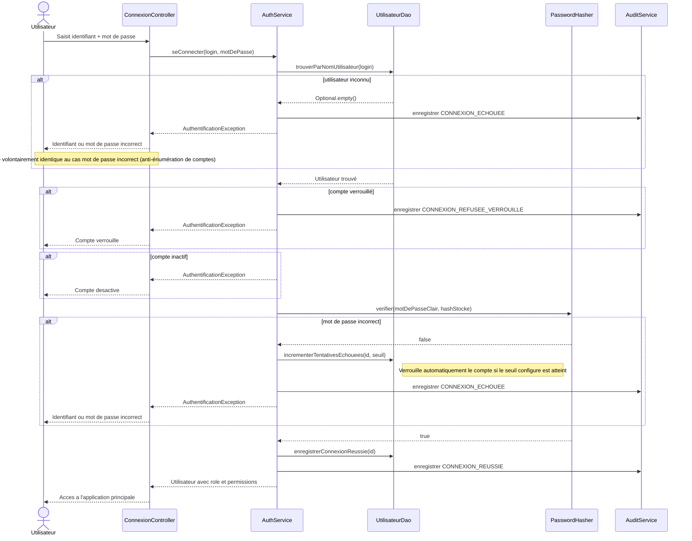
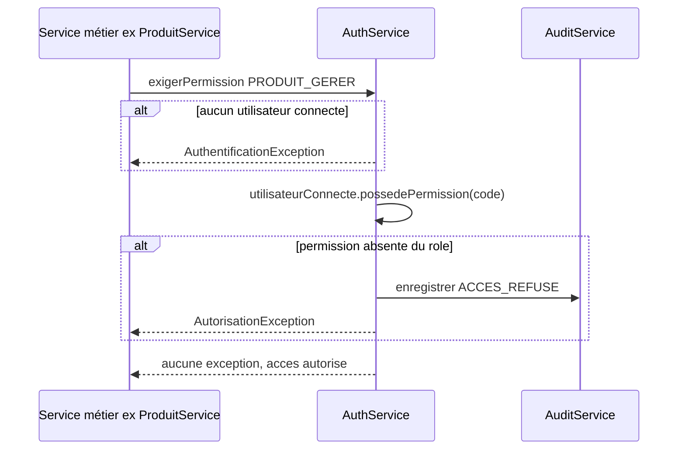

# Diagramme de séquence — Authentification et contrôle d'accès

## Diagramme de séquence — Vérification d'une permission

Ce contrôle est exécuté par chaque méthode sensible des services métier
(`ProduitService`, `VenteService`, etc.), **indépendamment** de ce que
l'interface affiche ou masque.

