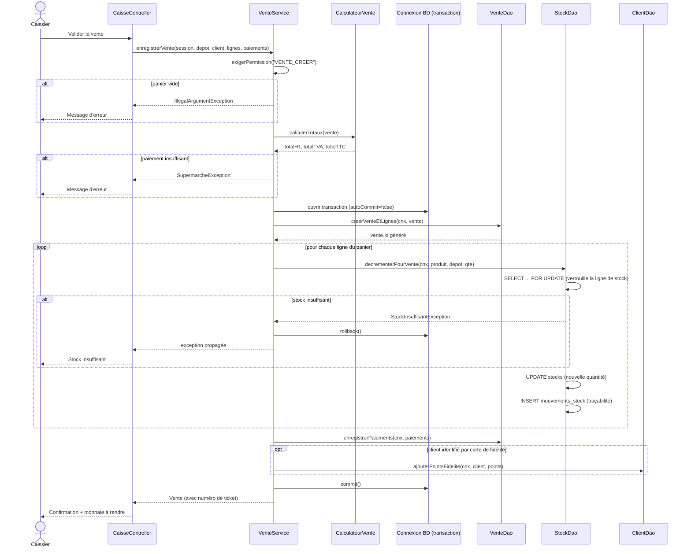

# Diagramme de séquence — Enregistrement d'une vente

Ce flux est le plus critique de l'application : il doit garantir qu'une
vente n'est jamais enregistrée sans que le stock correspondant soit
décrémenté (et inversement), même en cas de panne ou d'accès concurrent
de plusieurs caisses.

## Points clés de robustesse

1. **Transaction unique** : la création de la vente, la décrémentation du stock et l'enregistrement des paiements partagent la même connexion JDBC et ne sont validés (`commit`) qu'une fois toutes les étapes réussies. Toute erreur déclenche un `rollback()` complet.
2. **Verrouillage pessimiste** (`SELECT ... FOR UPDATE`) sur la ligne de stock : si deux caisses tentent de vendre simultanément le dernier exemplaire d'un produit, la seconde transaction attend que la première se termine avant de lire la quantité, ce qui évite un stock négatif.
3. **Calcul des totaux avant toute écriture** : `CalculateurVente` est un calcul pur, exécuté avant l'ouverture de la transaction, ce qui permet de rejeter une vente invalide (paiement insuffisant) sans jamais toucher la base.
