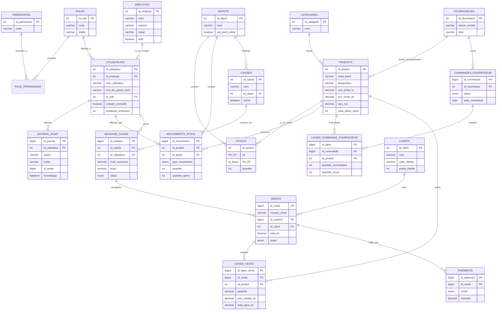

# Modèle de données (entité-relation)

Reflet fidèle du schéma SQL défini dans `database/01_schema.sql`.

## Choix de modélisation notables

- **`stocks` a une clé primaire composite** `(id_produit, id_depot)` : un produit a une quantité distincte par dépôt, ce qui anticipe une extension multi-magasins sans changer le schéma.
- **`lignes_vente` historise `prix_unitaire_ttc` et `taux_tva`** plutôt que de les recalculer depuis `produits` : un ticket de caisse doit rester fidèle au prix payé même si le tarif catalogue change ensuite.
- **`mouvements_stock` conserve `quantite_apres`** (la quantité résultante, pas seulement le delta) : permet de retrouver l'état du stock à un instant donné sans avoir à rejouer tout l'historique.
- **Suppression douce uniquement** : les entités `produits`, `fournisseurs`, `employes`, `utilisateurs` ont un champ `actif` plutôt qu'une suppression physique, pour préserver l'intégrité référentielle avec l'historique des ventes/commandes passées.
